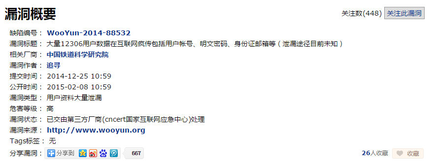
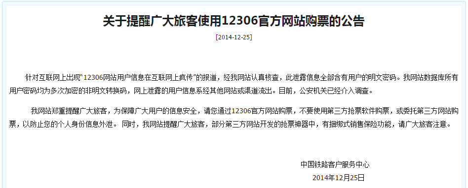
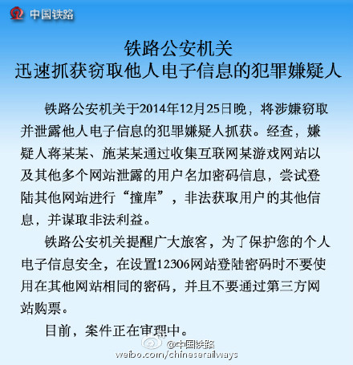



## 新闻回顾

12月25日圣诞节，据漏洞反馈平台乌云网[显示](http://www.wooyun.org/bugs/wooyun-2014-088532)，大量12306用户数据在互联网疯传。本次泄露的用户数据包括用户帐号、明文密码、身份证、邮箱等。

随后，12306官方发表公告，称经过认真核查，此泄露信息全部含有用户的明文密码。12306网站数据库所有用户密码均为非明文转换码，网上泄露的用户信息系经其他网站或渠道流出。

12月26日，中国铁路官方微博发消息，铁路公安机关将涉嫌窃取并泄露12306网站电子信息的两名犯罪嫌疑人抓获，并指出此次用户信息泄漏事件是犯罪嫌疑人“撞库”来完成信息的窃取。

好了，这个事件到此估计就没什么下文了，因为在中国用户隐私数据泄漏仿佛不是一天两天的了，从你每天能接到几个诈骗、销售电话就能感受到。那么，作为普通用户，怎样最大限度地保护我们的隐私呢？接下来你可以看下面的文字，我试图以简单明了的语言（*注：不一定非常专业*）解释一下网站如何存储用户密码，以及给大家在今后如何保护自己信息安全方面上一些建议。

## 网站如何存储我们的信息

当你在一个网站注册成为其用户时，大多网站需要你提供账户名、邮箱、密码等，甚至有些网站还会让你填手机号、身份证号等更为敏感的信息。而如何保存这些信息将成为一个重大的问题，因为任何网站都存在被攻击的风险，一旦数据库被盗将会造成不可弥补的损失。我们下面只讨论网站一般如何来保存密码数据的，这是我们最为关心的。

目前最普遍的做法是——将用户密码加密存储。所谓的加密就是采用一种算法将明文映射为密文，我们称为 hash（哈希），而加密算法有很多种，这里就不详细介绍，只要明白一点，这种加密算法是**不可逆**的，即不存在一种解密算法将密文又一一转化为明文。

在用户注册时，网站对用户填写的密码进行加密，网站数据库中只保存加密之后的密码，而在任何地方都不会保存密码的明文。当用户登录该网站是，填写用户名和密码，网站会将该密码通过同样的加密算法进行转换，与数据库中保存的该用户名对应的加密的密码进行比较，如果相等，表示密码正确。

这里要指出两点：

1. 密码在经过加密时，不再在任何地方保存明文密码，因为一旦保存了明文密码，就会存在被盗的风险。几年前报道的 CSDN 网站服务器被入侵，600万用户帐号及明文密码泄露，当时被广为吐槽的是 CSDN 竟然保存明文密码。这就是我们在上面新闻中看到12306官方的公告中特别指出的，“我网站数据库所有用户密码均为多次加密的非明文转换码”。当然目前这是一种普遍的做法了，这也是为什么我们登录某个网站忘记密码时，该网站给你发一个重置密码的链接，而不是告诉你原来的密码（因为他们也不知道），当然不排除有些小网站仍然采取明文保存密码的做法。
2. 正因为加密是不可逆的，即使因为安全原因数据库被盗，黑客有了加密之后的密码，它也不能通过一种解密算法将密文转化为明文。这就加大了我们的密码信息的安全。但是不是拿到这些密文就没有办法破解了呢？非也！

## 网站对密码盐化后加密

如果黑客入侵网站的数据库，拿到加密之后的密码，如何找到明文呢？由于目前加密算法比较经典的就那几种，md5、sha1 等等，而用户在选用自己的密码时，很多使用的是一种“**弱密码**”，即简单的数字和字母的组合，例如 "iloveyou123"、"123456" 等等， SplashData 公布[2013 年最常用的 25 个密码](http://splashdata.com/press/worstpasswords2013.htm)，你就可以看出排名靠前的都是积弱的密码。那么黑客只需要枚举出所有的单词和各种数字等的组合，例如使用 md5 算法进行加密，构造出一张大表（我们称为“**彩虹表**”），将这张表的加密之后的密文与盗取的数据库中密文进行比较，如果有匹配的，那么就找到了明文，即可用来登录的密码。

解决方法之一就是网站在保存密码时，对密码进行**盐化**（salted），即在用户的密码之上加上一串特殊字母之后再进行加密，例如加上`f#@V)Hu^%Hgfds`这样的字符串，那么即使你密码是 "123456"，加上之后就成为了 "f#@V)Hu^%Hgfds123456"，这无疑就是一个“强密码”了。

解决方法之二就是有些网站在你注册时对你输入的密码进行各种限制，例如至少有数字、字母、特殊字母的组合，甚至有要求至少一个大写字母，就是为了减少能枚举出来的概率，也其实也是一种盐化策略，只不过让用户来做。

但是不是网站对密码进行盐化之后就安全了呢？更多关于 hash 对网站加密可以参看我的一篇文章：[Hash 函数及其重要性](http://www.cnblogs.com/hazir/p/hash_function_and_its_importance.html)，更偏向于技术的介绍。

## 什么是“撞库”

而此次12306网站用户信息泄露并不是网站被入侵导入数据库被盗，我们注意到开头的新闻回顾中中国铁路官微中提到一个词“撞库”，这又是什么意思呢？

在黑客术语里面，“拖库”是指黑客入侵有价值的网络站点，把注册用户的资料数据库全部盗走的行为，因为谐音，也经常被称作“**脱裤**”，360的库带计划，奖励提交漏洞的白帽子，也是因此而得名。在取得大量的用户数据之后，黑客会通过一系列的技术手段和黑色产业链将有价值的用户数据变现，这通常也被称作“**洗库**”。最后黑客将得到的数据在其它网站上进行尝试登陆，叫做“**撞库**”，因为很多用户喜欢使用统一的用户名密码。

以上解释来源于文章：[<撞库攻击：一场需要用户参与的持久战>](http://www.freebuf.com/articles/database/29267.html)。

想想你自己，你有自己的 QQ、微博、淘宝、各种BBS、邮箱、网银等等账号，而账号和密码是否都不一样呢？而如果都一样，那么你就有很大风险了！你注册的网站其中的有一个被入侵导致信息泄露，那么用着同样的账号和密码来试图登陆你注册的其它网站，很大可能就登陆成功了，从而盗取你在上面的信息。这次12306事件目前来看就是这样来做的，犯罪嫌疑人利用已经泄漏的用户信息来登录12306，登录成功之后就可以获取用户的手机号、邮箱、身份证号等有价值的隐私数据了。

我个人觉得这是目前危害用户信息安全的最重要的途径之一，往往我们不经意之间注册了一个钓鱼网站或者注册的某个网站数据库被盗，这就危害到我们注册的所有网站的信息安全。

## 我的建议

好了，说了这么多，其实就谈了两点：一是通过解释网站密码加密算法来告诉你设置复杂的密码，而是通过解释“撞库”这种盗取用户信息的技术手段来告诉你密码不要设置为同一个。其实，我们可以完全在设置密码的时候可以将两者统一了——**为每个网站密码设置不同的复杂的密码**。也许有些人就会站出来反驳我，你真是站着说话不腰疼，我注册的网站几十个，每个网站设置不同的密码，而且还是那种复杂的密码，我怎么记得住！这也是我之前非常头疼的事，但好在有比较好的解决方法：

* 利用各种密码管理工具，例如1Password、Lastpass、Keepass 等等，都提供了移动客户端以及浏览器插件，支持动态生成复杂密码以及同步功能，有了这些工具的帮助，妈妈再也不用担心我记不住密码了。
* 但有些人总觉得工具还是太麻烦，尤其是换个电脑登录就更显得吃力，我可以告诉你一种简单有效的生成不同复杂密码的方法——你想一个基本密码，例如`As@520_`，再将注册的网站的域名插入到该简单密码中间，可以是任何地方，你记住就可以了，例如我们统一插到最后吧，那么简书的密码就是`As@520_jianshu`，微博的密码就是`As@520_weibo` 等等，如果你显得域名太简单了，你可以把域名变得复杂一些，倒置、加1等等，但一定要与该网站对应起来。如此一来，你就有对每个网站有了不同的超复杂的密码了。

这是关于管理设置密码的建议，更多其它建议我想大家都知道，只是执行力的问题了，例如尽量不要用自己的主邮箱、常用密码来注册不健康网站（哪些是不健康你懂的:-)）等等。互联网、大数据时代下，用户隐私越来越暴露在大庭广众之下，我想这不仅仅是用户个人注意就能解决的事，更多的是需要从事的企业对用户隐私数据的保护意识、国家相关法律法规的健全，才能让用户少接一次诈骗电话、少泄露一些隐私。

## 参考文献：

* [知乎问答：如何看待 2014 年 12 月 25 日网传 12306 账号信息泄漏（含明文密码）一事？](http://www.zhihu.com/question/27244285)
* [Hash 函数及其重要性](http://www.cnblogs.com/hazir/p/hash_function_and_its_importance.html)
* [撞库攻击：一场需要用户参与的持久战](http://www.freebuf.com/articles/database/29267.html)
