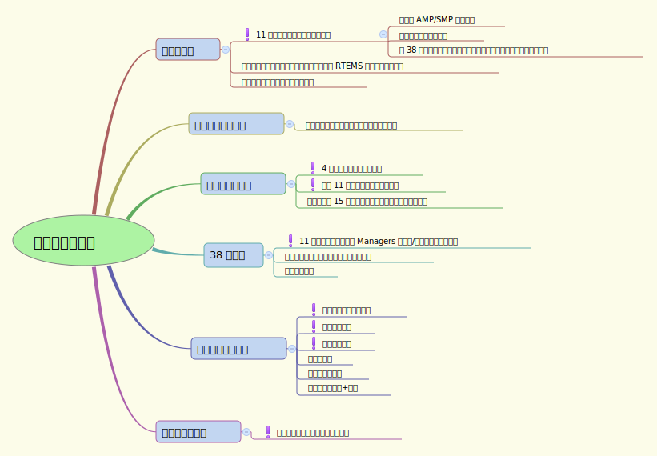

 

距离寒假还有差不多一个月零一个星期，时间很宝贵，如何利用好这段时间关系到下学期能否在压力中度过。这段时间可以大体划分为三个阶段：

* 1月4日～1月10日：共一周时间，养成一个好的时间管理习惯，将一些杂事处理掉。
* 1月11日～1月16日：共六天，白天华为公司入职培训，晚上的时间可能需要做些题目+整理培训成果，基本没什么时间来干别的事情。
* 1月17日～放假：差不多三周时间，这是最关键的时间，一心扑倒在小论文的写作上。

具体安排参见下图，打感叹号的为第一周要着手完成的工作：

