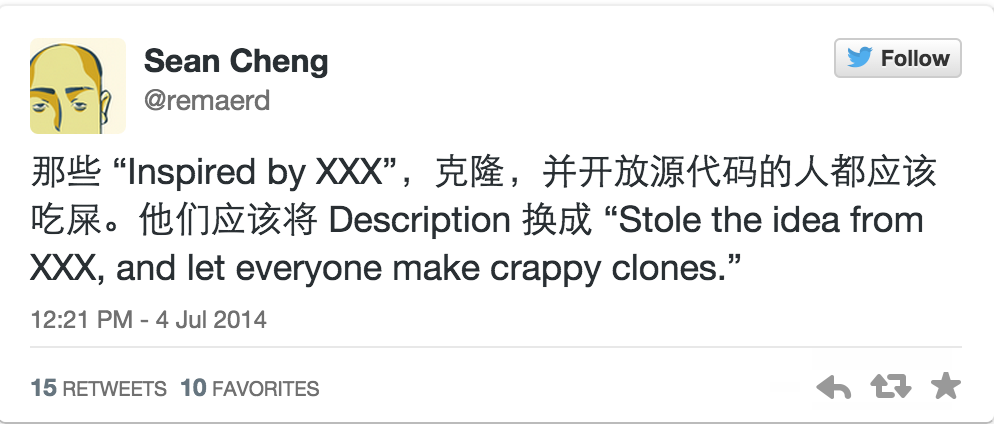
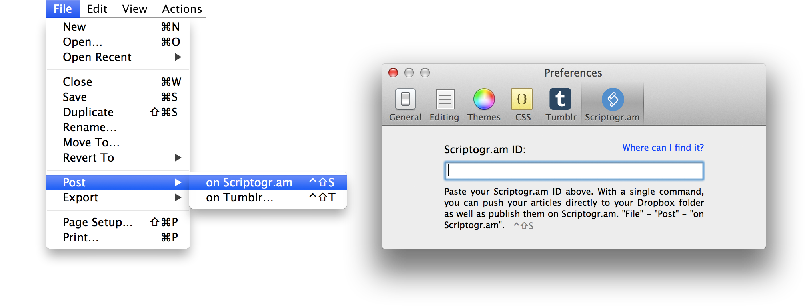
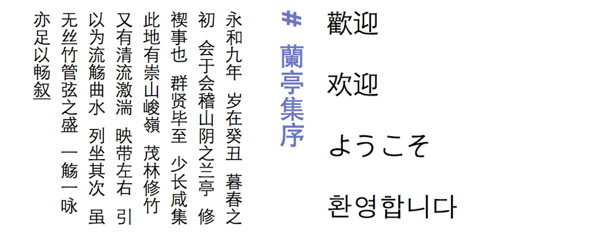
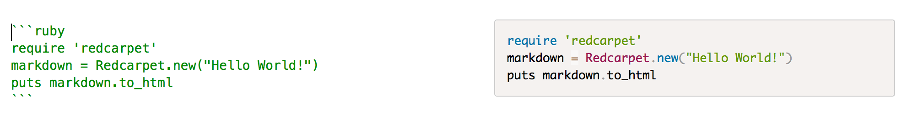
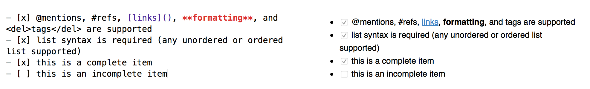
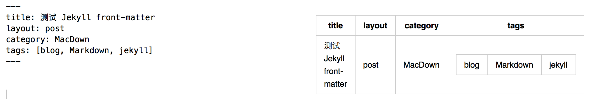

 

[Mou](http://25.io/mou/) 和 [MacDown](http://macdown.uranusjr.com/) 是我在 Mac 下用过的两款优秀的 Markdown 编辑器。之前一直使用的是 Mou，但不知怎的最近 Mou 在保存时总有 4s 以上的卡顿，这让我很不爽，没找到有效的解决方法，于是我被迫去寻找其它的 MD 编辑器。我尝试过很多种，但总觉得没有 Mou 体验好，最终让我找到了 MacDown——OS X下开放源代码 Markdown 编辑器。

## 背后的故事

很有兴趣关注了这两款软件的作者及背后的故事，发现很有趣，在评测两款软件之前我们先八一八故事吧。

Mou 的作者罗晨，个人主页：[http://chenluois.com/](http://chenluois.com/)，现居住天津，自由职业者。MacDown 的作者Tzu-ping Chung，个人主页：[https://uranusjr.com/](https://uranusjr.com/)，现居住台北市，应该是台湾同胞吧。

根据 MacDown 作者的[介绍](https://uranusjr.com/blog/post/58/introducing-macdown/)，他曾经一度是 Markdown 的重度用户，而使用的编辑器基本是 Mou，但 Mou 可以处理[fenced code blocks](https://help.github.com/articles/github-flavored-markdown#fenced-code-blocks)，却对代码高亮不支持，同时在渲染 Markdown 时也有 bug，这让他很苦恼。Mou 的作者当时正准备[转手](http://www.v2ex.com/t/112732)该软件，一直没有更新，所以，他就开始从头开始模仿 Mou 写一个，因为是 Markdown editor for Macs，所以取名为 MacDown。

MacDown 作者 Chung 在征得 Mou 作者 Luo 的同意使用了 Mou 的几款主题，发布了 MacDown 的原始版本。Luo 最后发现 MacDown 时，很气愤，并指责 Chung 是 copycat，意思是 MacDown 山寨了 Mou。Chung 也意识到确实是自己抄袭了 Mou 很多东西，根据某条推文的[建议](https://twitter.com/remaerd/status/484914820408279040)（并不是Luo发布的），将之前 github 中[项目描述](https://github.com/uranusjr/macdown/blob/master/README.md) 改成了：

> MacDown is an open source Markdown editor for OS X, released under the MIT License. The author stole the idea from Chen Luo’s Mou so that people can make crappy clones. ^[1](https://github.com/uranusjr/macdown/commit/b6f87f123ace20cd1cc44c9f98d9d6a911f50b9c)

比较详细的情节可以参见 Chung 的[博客](http://macdown.uranusjr.com/blog/post/5/show-hn-macdown/)。至于 MacDown 和 Mou 的关系是怎样的，是不是 MacDown 就是不道德地克隆了 Mou 呢？这个每个人都有自己的看法，这里就不讨论了。

欣喜的是，目前两款软件都找到自己的发展模式，Mou 已经完成了众筹，即将发布 1.0 版本，如果有对 Mou 有情怀的同学可以[支持](http://25.io/mou/store/)作者；MacDown 依旧会走自己开源的道路。 

Chung 的一句话也道出了我的心声：

> Let’s focus on making better software for everyone.

好了，八卦完了，最后我要对两位作者表示由衷的谢意，贡献给我们好用的软件！下面我会根据我体验，分别提一下两款软件各自的特色地方。

## 共同点

* 提供丰富的简洁大方好看的主题，同时支持自定义
* 提供丰富的渲染 Markdown 之后的 CSS 样式，同时支持自定义样式
* 英文单词的自动补全功能，按下 `Esc` 键列出补全的列表
* 字符、单词统计功能
* 支持 
* TeX 数学公式的支持
* 支持导出 HTML 和 PDF 两种格式
* 便捷的快捷键操作
* ...

## Mou 特色功能

### 集成 Tumblr 和 Scriptogr.am 发布博文

可以配置 Tumblr 和 Scriptogr.am 的邮箱，在 Mou 上写文章通过 `File->Post->` 可以发布到这两个平台上，非常方便。

### 语言支持

Mou 内置 CJK 字符支持，你可以很容易使用中文、日文、韩文等来写文章，同时还支持竖排的风格。

## MacDown 特色

### 代码高亮

Mou 和 MacDown 都支持 fenced code blocks（前后三个反引号可以表示代码块），但 MacDown 支持加语言标识符实现代码高亮，这对程序员来说简直是福音啊，非常棒的功能。

### GFM Task List 支持

MacDown 支持 [Task list]()，有了这个功能，你可以将你的 MD 编辑器立马变成 TODO list，是不是很赞？

### Jekyll Front-matter 支持

很多人使用 Jekyll 作为博客引擎，这时 Jekyll 的前面那段该怎么去渲染呢？MacDown 和 github 一样可以支持。

## 总结

OK，总结完了，如果不是 Mou 在我的 Mac 上有卡顿，我也没想着要换一款编辑器，目前我在用 MacDown 感觉还是很不错的，因为有代码高亮支持就足以把我留下了。至于你选哪一款，你可以下载下来自己体验体验，反正软件都很小。也许你跟我一样，因为某个小瑕疵放弃某个软件，又因为某个小功能的惊喜而喜欢上某个软件。

