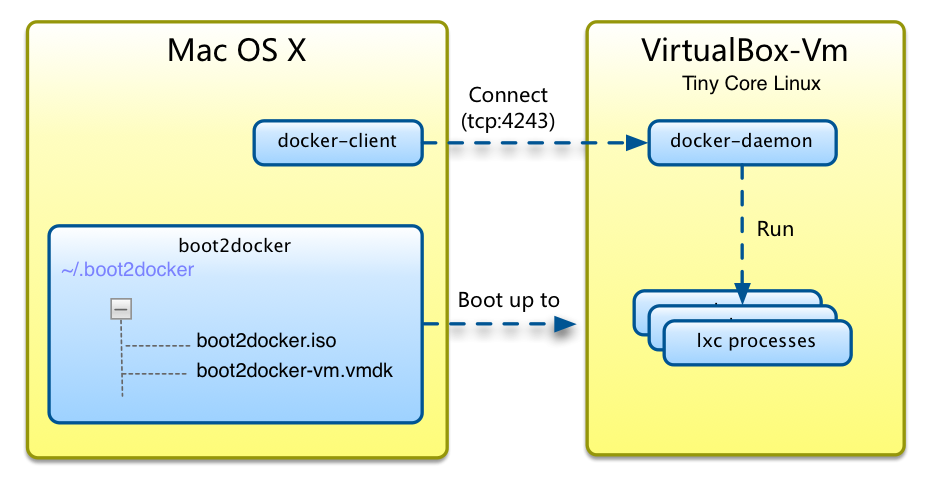

 

由于 Docker 引擎只能在 Linux 内核上运行，因此你想在 OS X 上运行 Docker，你必须使用虚拟机（VM)安装一个 Linux 内核的操作系统。使用 OS X Docker 客户端来控制虚拟化 Docker 引擎来建立、运行和管理 Docker 容器。

为了简化起见，我们使用官网提供的 [Boot2Docker](https://github.com/boot2docker/boot2docker) 脚本来安装 VirtualBox 虚拟机。

## 安装

1. 下载最新版本的 [Docker for OS X Installer](https://github.com/boot2docker/osx-installer/releases/latest)，找到绿色的 `Boot2Docker-x.x.x.pkg` 按钮，点击下载。
2. 双击下载的安装包进行安装，会安装一个 VirtualBox 虚拟机、Docker 本身以及 Boot2Docker 管理工具。
3. 在 `Application` 文件夹中找到 `Boot2Docker` 应用，运行它。或者你可以在命令行中运行下面的命令来初始化 Boot2Docker：      

``` bash
$ boot2docker init
$ boot2docker start
$ $(boot2docker shellinit)
```

会弹出一个终端窗口，同时你会看到虚拟机启动起来了。一旦完成了虚拟机的初始化，你可以使用 `boot2docker stop` 和 `boot2docker start` 来控制它。

> **注意：** 如果你在终端下看到类似于这样的信息：***To connect the Docker client to the Docker daemon, please set: export  DOCKER_HOST=tcp://192.168.59.103:2375***，你可以按照指示来设置环境变量。

查看 [Boot2Docker ReadMe](https://github.com/boot2docker/boot2docker/blob/master/README.md) 获取更多信息。


## 运行 Docker

>**注意：** 如果你使用的是远程连接到 Docker 守护进程，例如 Boot2Docker，那么在 `docker` 命令前不要加 `sudo` 。

在你的终端下，你可以运行我们简单的 `hello-world` 示例镜像来测试 Docker 是否正确运行。启动虚拟机（`boot2docker start`），然后运行：

``` bash
$ docker run hello-world
```

这会下载 `hello-world` 镜像，然后创建一个小的容器，在容器中执行程序打印 `Hello from Docker.` 简短的信息。


## 原理

我们分析 Mac 下安装 Docker 的原理，下面是整体框架图：



如图所示，安装完成后，具体情况如下：

* 在 Mac OS X 的 home 目录 `~/.boot2docker` 下创建了虚拟机所需要的文件，其中 `boot2docker.iso` 是虚拟机映像，这是一个由 CD-ROM 引导的 TinyCoreLinux 系统； `boot2docker-vm.vmdk` 文件则是你的虚拟机磁盘，你所有的持久化数据都存放在这里，包括docker创建的 Docker 容器等文件。
* 在 Mac OS X 下，docker 被分为客户端 docker-client 和服务端 docker-daemon 两部分，而在 Linux（比如ubuntu）下，实际上则是同一个可执行文件同时充当客户端和服务端。docker-daemon 可以监听 unix scoket 或者 tcp socket（默认端口为4234），docker-client 会通过一个叫 **DOCKER_HOST** 的环境变量读取服务地址和端口，因此在启动时会提示你设置该环境变量。
*  docker-daemon 跑在虚拟机上，这个程序实际上就是接收docker-client 发送过来的消息命令，创建、启动和销毁 Docker 容器，以及 Docker 本身的版本管理、映像存储等等。


## 参考文献：

* [Installing Docker on Mac OS X--Docker Docs](https://docs.docker.com/installation/mac/)
* [利用Docker构建开发环境--UC技术博客](http://tech.uc.cn/?p=2726)


