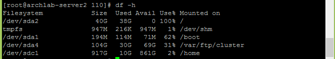
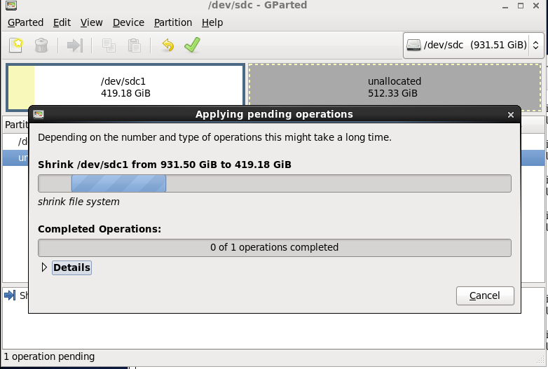

 

## 问题描述

研一的小伙伴向我反应实验室的 Confluence 知识管理系统上传不了附件，经过排查发现是磁盘空间不足了，使用 **`df`** 命令查看磁盘使用量如下图：



实验室的文件服务器有三块硬盘，分别为 250GB、1TB、1TB，对应的设备文件名分别为 `/dev/sda`、`/dev/sdb`、`/dev/sdc`，但图中看到只有两块硬盘的信息，是因为第二块磁盘作为物理的 RAID1 备份第三块磁盘。

现在文件系统的挂载信息如下：

磁盘分区 | 设备名 | 大小  | 可利用率 | 挂载点 |
--------| ------|-------|---------|-------|
Disk1 Partition1   | /dev/sda1 |  194MB |  62%  |   /boot |
Disk1 Partition2   | /dev/sda2 |  40GB  | 100%  |   /   |
Disk1 Partition4   | /dev/sda4 |  104GB | 31%   | /var/ftp/cluster |
Disk3 Partition1   | /dev/sdc1 |  917GB | 2%    |  /home |

通过下面的 **`du`** 命令可以看到 Confluence 的工作目录 `/var/atlassian` 已占用 22GB：

```
[root@archlab-server2 /]# du -sh /var/atlassian/
22G     /var/atlassian/
```

当时搭建服务器的时候磁盘规划不合理，才导致现在磁盘空间不足的现象。那现在补救的方法只能是重新划分磁盘分区，初步计划是完成下面两步：

* 减小磁盘3上分区1的大小，在磁盘3上增加一个新的分区；
* 将新增分区挂载到 `/var/atlassian` 目录下，将以前该目录在磁盘1上的文件拷贝到新分区并释放以前分区空间。


## 减小分区大小

首先减小 Disk3 的第一个分区的大小，由于该分区已经挂载到 `/home` 目录下，因此先要卸载该分区（在卸载之前做备份，将该目录全部拷贝到另一个分区上），使用命令 **`umount`** 卸载：

```
[root@archlab-server2 /]# umount /dev/sdc1
umount: /home: device is busy.
        (In some cases useful info about processes that use
         the device is found by lsof(8) or fuser(1))
```

提示设备忙的信息，原因是由于 `/home` 目录正在被某个进程使用，可以使用 **`fuser`** 命令来终止使用该目录的所有进程：

```
[root@archlab-server2 /]# fuser -km /home
/home:                2639m
```

再完成卸载即可。现在可以调整该分区的大小，有两种方法：一种是使用命令行命令来操作，另一种是使用图形化的软件 GParted。其实图形化软件也是调用 Linux 的命令来实现的，这里为了简便我就安装了 GParted，使用该软件完成调整分区的大小（该软件操作很简单，就不多说），如下图：



将 `/dev/sdc1` 调整到近 420GB。最后别忘了通过命令 **`mount`** 将 `/dev/sdc1` 重新挂载到 `/home` 目录下，否则访问 `/home` 目录下的文件就自动去 `/dev/sda2` 磁盘分区下寻找：

```
[root@archlab-server2 /]# mount /dev/sdc1 /home
```


## 新增分区

接下来在未分配的 500 多GB 上再分出一个分区（200GB），也可以使用 GParted 来分配，这里我使用命令 **`fdisk`** 来完成：

```
[root@archlab-server2 /]# fdisk /dev/sdc

WARNING: DOS-compatible mode is deprecated. It's strongly recommended to
         switch off the mode (command 'c') and change display units to
         sectors (command 'u').

Command (m for help): p

Disk /dev/sdc: 1000.2 GB, 1000204886016 bytes
255 heads, 63 sectors/track, 121601 cylinders
Units = cylinders of 16065 * 512 = 8225280 bytes
Sector size (logical/physical): 512 bytes / 4096 bytes
I/O size (minimum/optimal): 4096 bytes / 4096 bytes
Disk identifier: 0x358b358b

   Device Boot      Start         End      Blocks   Id  System
/dev/sdc1   *           1       54721   439544800+   7  HPFS/NTFS
Partition 1 does not start on physical sector boundary.

Command (m for help): n
Command action
   e   extended
   p   primary partition (1-4)
p
Partition number (1-4): 2
First cylinder (54721-121601, default 54721):
Using default value 54721
Last cylinder, +cylinders or +size{K,M,G} (54721-121601, default 121601): +200G

Expert command (m for help): w
The partition table has been altered!
```

使用指令 **m** 可以列出所有指令的含义，指令 **p** 打印出该磁盘的所有分区信息，**n** 创建分区，输入新建分区的信息（如分区类型、分区起始结束位置等），这里为新增分区分配了 200GB 的空间，完成之后输入 **w** 才执行实际的操作，更改分区表。

## 格式化分区

分区完成后要进行文件系统的格式化，使用命令 **`mkfs`** 指定格式化文件系统的类型:

```
[root@archlab-server2 /]# mkfs -t ext4 /dev/sdc2
```

## 挂载分区

新增并格式化一个分区之后，就到最后一步，将该分区挂载到 `/var/atlassian` 目录下，操作步骤如下：

1. 将 `/dev/sdc3` 挂载到一个临时的目录，如 `/home/tmp`
2. 将 `/var/atlassian` 目录下所有文件剪切到 `/home/tmp` 下，即为 `/dev/sda2` 释放空间
3. 将 `/dev/sdc3` 从 `/home/tmp` 目录下卸载
4. 最后将 `/dev/sdc3` 挂载到 `/var/atlassian` 下

由于都是使用 `mount` 和 `umount` 两个命令来完成，就不写出命令过程了。

那么通过上述几步即完成了 `/var/atlassian` 目录下的数据由以前存放在 **磁盘1分区2** 到 新增的**磁盘3分区2** 上的转移，

最后我们用块设备查看命令 **`lsblk`** 查看系统块设备信息：

```
[root@archlab-server2 /]# lsblk
NAME   MAJ:MIN RM   SIZE RO TYPE MOUNTPOINT
sda      8:0    0 149.1G  0 disk
├─sda1   8:1    0   200M  0 part /boot
├─sda2   8:2    0    40G  0 part /
├─sda3   8:3    0     4G  0 part [SWAP]
└─sda4   8:4    0 104.9G  0 part /var/ftp/cluster
sdb      8:16   0 931.5G  0 disk
├─sdb1   8:17   0 931.5G  0 part
sdc      8:32   0 931.5G  0 disk
├─sdc1   8:33   0 419.2G  0 part /home
└─sdc2   8:34   0 331.5G  0 part /var/atlassian
```

## 总结

* 熟练掌握几个磁盘管理的命令 —— `df` / `du` / `fdisk` / `mkfs` / `mount` / `umount` 等
* 理解磁盘分区、文件系统、挂载点的概念
