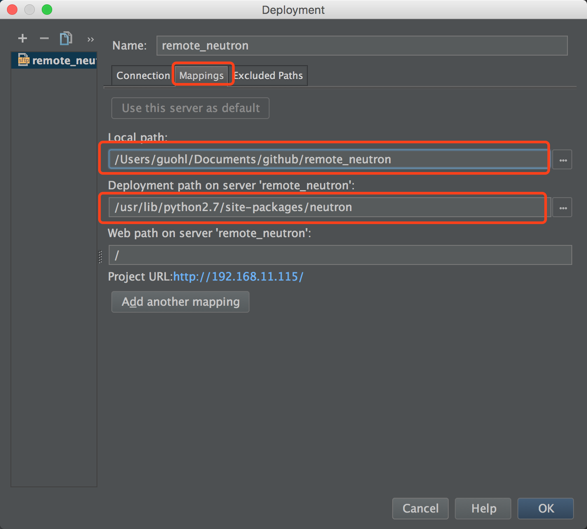

## 实验背景及环境介绍

众所周知要深入学习一款开源软件就去阅读它的源码吧，但如果只是阅读冷冰冰的代码，往往是一头雾水，你肯定希望知道代码运行起来的上下文、变量值的变化，那么你需要调试。对于 Openstack 来说，大多代码都是开源 Python 编写的，这对于学习来说成本低很多，因为你可以随时修改它的代码，重启下进程你的代码就开始运行了。即使这样，对于调试 Openstack 这样大型的软件还是一件困难的事，以前我调试有用过打印日志、pdb 加断点的方法，但效率都不高，直到我们组来了个新员工，新员工还是比较活跃的、比较创新的，经他介绍 Pycharm 是支持远程调试的。看到他给我的演示，确实是个很不错的调试方法，这里简单介绍下该种方法供大家参考。

简单介绍下我的实验环境：

* 本地机器：操作系统 macOS Sierra，IP地址 192.168.11.100，安装了 Pycharm Professional 4
* 远程机器：操作系统 CentOS 7.2， IP地址 192.168.11.115，采用 RDO 部署了 Openstack O 版本

下面是详细的操作步骤：

## 创建本地工程

此步主要完成本地代码与远程代码的同步，可以将远程代码下载到本地，也可以将本地在 Pycharm 中修改的代码很快部署到远程环境中。

1) 打开 Pycharm，新建一个空的工程，如工程名为 remote_neutron。
2) 依次点击【Tools】->【Deployment】->【Configuration...】弹出配置窗口，按照下面步骤进行配置。

* 点击左上角的”+”添加一个部署工程，输入名称和选择连接的协议：


* 在【Connection】下填写需要连接的远程机器的基本信息，如 ssh 登陆的 IP:port、账户密码，填完之后点击【Test SFTP connection...】按钮进行测试：


* 在【Mappings】下需要填写本地目录到远程机器的目录映射关系，如这里填写的本工程目录映射到远程机器的 neutron 的 Python 安装目录：




3) 从远程机器下载 neutron 代码到本地工程， 依次点击【Tools】->【Deployment】->【Download from neutron_remote】，Pycharm 下面的状态栏中会显示下载的状态。


## Python 远程调试配置

下面需要配置远程调试器，原理如下：Python 远程调试模型其实是一个典型的Server/Client模型。Pycharm 运行了一个 Debug Server，监听本地的某个端口，等待 Client 的接入；远程机器运行的 Python 程序调用 pycharm-debug 提供的 pydevd 库，连接到服务端。这样，本地主机就可以使用 PyCharm 调试远程主机运行的Python程序了，调试的方法与直接调试本地Python程序一样。如[下图](http://dasheyuan.com/post/pycharm-remote-debugging/)所示：


配置步骤如下：

4) 依次点击【Run】->【Edit Configurations...】弹出对话框，进行远程调试器的配置。

* 点击左上角的"+"号按钮添加一个“Python Remote Debug”，配置调试器的信息，需要填写名字、本机的IP地址及端口：


* 再点击【Path mappings】配置本地与远程目录的映射关系，左下角"+"号按钮添加一个映射关系，这地方要配置正确，方便后面调试时本地代码可以和远程代码对应上：


5) 远程作为调试的 Client 端，需要使用到 pydev 库，该库可以从本地 Pycharm 的安装目录下拷过去，如果是 Python2 的话是 `pycharm-debug.egg`，Python3 的话对应的是 `pycharm-debug-py3k.egg`。

6) 拷贝到远程机器之后，使用命令 `easy_install pycharm-debug.egg` 来安装该 Python 库，这样就可以使用 pydevd 库了。

## 开始调试

一切就绪之后，终于可以开始调试了。

7) 调试之前需要修改引用 eventlet 的代码，否则断点会有问题。对于 Neutron 项目来说，eventlet 引用有个统一的入口，在 `common/eventlet_utils.py` 文件中，将 `eventlet.monkey_patch()` 修改为 `eventlet.monkey_patch(all=False, socket=True, time=True, thread=False)`。在 Pycharm 中修改完成之后，需要在该窗口右键点击【Upload to remote_neutron】，将修改的内容同步上传到远程的环境中。

8) 这里举个调试的例子，我想跟踪 Neutron 查看网络的代码裸机，那么在 `plugins/ml2/plugin.py` 文件中修改 `get_network` 函数，新增如下的两行，同样修改完成后右键上传到远程的环境中。

``` python
import pydevd
pydevd.settrace('192.168.11.100', port=12345, stdoutToServer=True, stderrToServer=True)
```

9) 点击【Run】->【Debug】选择你创建的远程Debug Server的名字，会弹出如下的内容，表示等待客户端连接进来。


10) 在前面修改了 Neutron 的代码并且上传到环境中，但修改的代码不能立马生效的，需要重启远程环境中 neutron-server 服务，才能使修改的代码生效。在远程机器上执行命令 `service neutron-server.service restart`，等待 Neutron 服务重启完成。

11) 在远程机器中执行 Neutron 命令查看某一个网络的信息，如 `neutron net-show public`，当执行到 `get_network` 函数时会中断，此时在 Pycharm 中会打印调用栈，接下来你可以像平时调试本地程序一样调试远程运行的 Neutron 代码了。


## 参考资料

* https://www.jetbrains.com/help/pycharm/remote-debugging.html
* http://dasheyuan.com/post/pycharm-remote-debugging/
