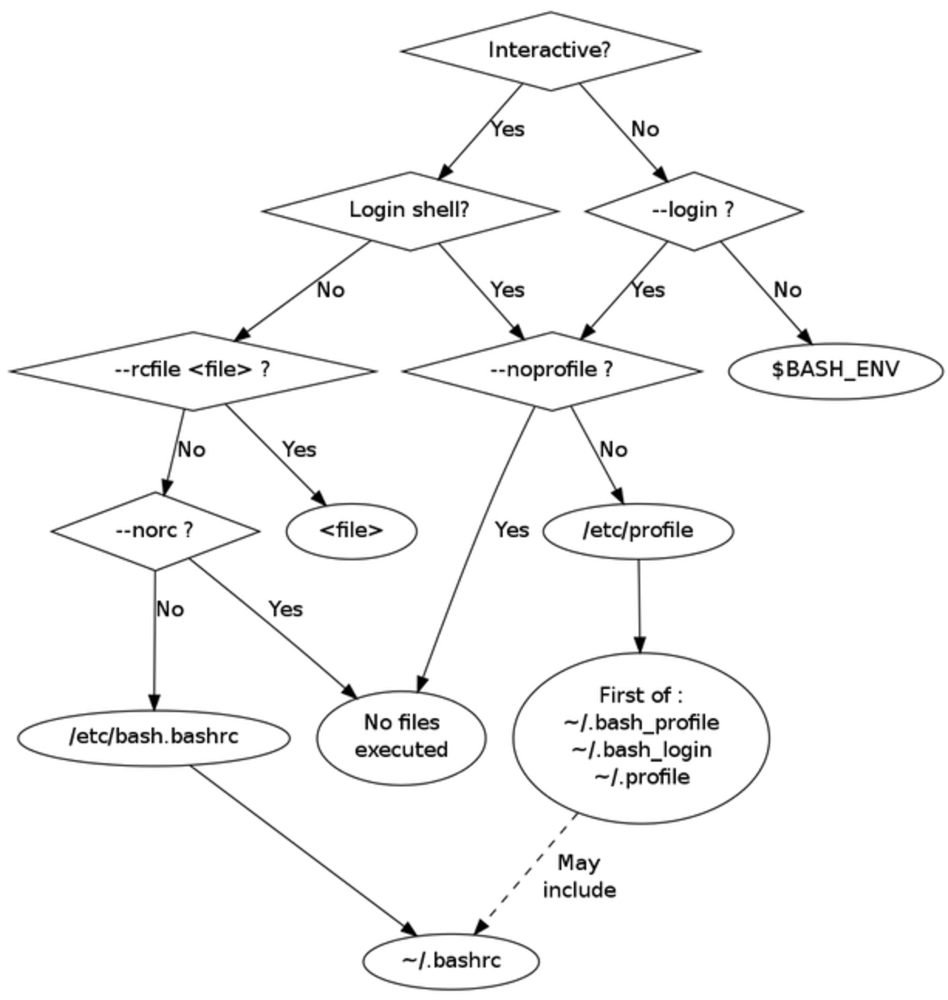

## 引言
国庆前最后一周，一线出现个问题，该问题直接导致现网服务长时间不可用，因此一线压力很大，当然这种压力直接传递到家里的开发这边，我参与了该问题原因的定位。由于存在时差以及不能直接上环境取日志、获取其他信息，因此定位时间也较长，花了两三天才把问题原因明确下来，弄得我也身心俱疲。

后来我自己复盘的时候，虽然该问题出现有其偶然性，在类生产和测试床都没有出现，但问题定位慢也凸显出我们的运维和开发对 Linux 基础知识的欠缺。简单描述该问题就是：一线在用 ansible 推送命令部署某服务时，由于某些步骤顺序不对导致触发了系统删除默认路由的逻辑，最后一步 yum 下包报网络连接不上的错误，由于我们系统中设置了 http 代理（写在 `/etc/profile.d/xxx.sh` 中），理论上默认路由删除也不影响下载包，但实际上却出现很多节点下包失败的错误。最终定位出来一线在用某个账户推送命令，现网很多节点中该账户家目录缺少 `.bashrc` 文件，这些节点下包都没有走 http 代理，而是走本地默认路由去连接 yum repo 服务器。

那何以缺少 `.bashrc` 文件影响到代理功能呢？看下面我的分析。

## shell 简介

shell 是 Linux 下提供给用户使用操作系统的一个接口，它既包括图形界面（GUI）的软件，也包括命令行（CLI）的软件，这里主要说的是后者。Linux 下 shell 也有多种，第一个流行的 shell 是由 Steven Bourne 编写的，为了纪念他一般称为 [Bourne shell](https://en.wikipedia.org/wiki/Bourne_shell)，或者直接简写为 sh；现在大多 Linux 发型版默认 shell 为 bash（Bourne Again SHell），是 Bourne Shell 的增强版，也是 GNU 的开源软件的一部分；另外还有 ksh、zsh 等等都属于 Bourne Shell 分支发展来的。另一个分支是伯克利大学的 Bill Joy 基于 BSD Unix 系统编写的 shell，由于该 shell 的语法类似于 C 语言，因此成为 [C SHell](https://en.wikipedia.org/wiki/C_shell)，简写为 csh，由于该 shell 与 bash 语法并不兼容，因此平时我们用的较少。

由于平时我们使用大多是 bash，或者与其兼容的其他 shell 如 zsh，本文主要介绍 bash。

## bash 的工作模式

bash 可以有不同的调出的方式，例如开机之后按 `Alt+F1`~`Alt+F6` 呼出不同的终端，输入账户密码进入的 shell；ssh 远程登陆到一台机器进行的 shell；又或者在一个 shell 中执行 `bash` 命令又创建了一个 shell。总的来说，根据不同的调出的方式，bash 的工作模式也不一样， bash 初始配置是不一样的，这是通过读取不同的配置文件来实现的。

主要可以分为 login 与非 login、interactive 与非 interactive，在 `man bash` 文档中 **INVOCATION** 有简单的说明。login 是指需要输入用户名和密码登陆的 shell；interactive 顾名思义为交互式，命令的标准输入与输出为该 bash 绑定到的终端。如果使用 bash 命令来创建一个 shell，可以加参数 `--login`/`-l` 来强制使其使用 login 的方式执行。

对一个 shell 如何判断工作在哪种模式下呢？我这边介绍一种方式：

1. 执行命令 `echo $-` ，查看输出的结果中是否含有 **`i`** 这一项，如果有则为 interactive，否则为非 interactive；（`$-` 这个变量记录着当前设置的 shell 选项）
2. 执行命令 `shopt login_shell`，查看输出的结果，如果为 **`on`** 则为 login，否则为非 login。（`shopt`命令用于显示和设置 shell 中的行为选项）


下表总结了组合之后得到的四种不同工作模式，其触发方式与读取的配置文件：

|    bash 工作模式   |   触发方式     |  读取配置文件    |   备注    |
|------------------|---------------|----------------|----------|
| login + interactive |  1. 登陆 Linux 获取的第一个 shell<br> 2. 通过 ssh *user_name*@*romote_ip* 登陆获取到的 shell <br> 3. 运行命令 bash -l 进入的 shell         |  1. 首先读取 /etc/profile 文件<br> 2. 再从下面三个文件读取到第一个存在的文件 ~/.bash_profile、~/.bash_login、~/.profile          |  /etc/profile 会依次读取 /etc/profile.d 下所有文件        |
| login + non-interactive | 1. 运行命令 bash -l *script.sh*            |  同上          |   该模式比较少用       |
| non-login + interactive |  1. 运行命令 bash           |  1. 读取 /etc/bash.bashrc<br> 2. 读取 ~/.bashrc文件          |    ~/.bashrc 一般会读 /etc/bashrc 文件      |
| non-login + non-interactive | 1. 运行命令 bash *script.sh*              | 1. 读取环境变量 $BASH_ENV 的值，导入该值的配置文件          |   有个特例见下文    |

当然上表只是 bash 的默认读取配置文件的方式，建议你在这些配置文件中加些 echo 信息，然后通过不通的方式调用 bash 来实践下。

同时，bash 命令还可以通过指定参数来改变这种默认行为，例如 `--rcfile`、`--noprofile` 等等，[下图](http://www.solipsys.co.uk/new/BashInitialisationFiles.html)更加清晰地展示了这点：




## ssh 远程执行命令属于哪种模式的 bash？

说到现在可能还不知道这个东西和我前面说的问题有什么关联吧？前面说过我把 http_proxy 这个环境变量设置在 `/etc/profile.d/xxx.sh`（`/etc/profile` 文件会去读）中，结合上表如果 bash 是 login shell 的话，必然会读取到；那为何有些节点没有设置 http_proxy 呢？难道不是 login shell 吗？我意识到 ansible 推送命令和 `ssh *user_name*@*romote_ip* *script.sh*` 类似，那么这种方式 bash 工作在哪种模式呢？通过实验来证明下：

```bash
$ ssh root@vlutr 'echo $-; shopt login_shell'
@~/.bashrc@
@/etc/bashrc@
hBc
login_shell    	off
```

上面输出的结果中前两行是我在 `~/.bashrc` 和 `/etc/bashrc` 打印的跟踪信息，后两行显示这种方式 bash 属于非 interactive 和非 login 模式，那结合上面的表格，应该读取环境变量 `$BASH_ENV` 的值作为导入环境变量的文件路径，但这个变量我们却没有设置啊，事实却是 ssh 远程执行命令会读取 `~/.bashrc` 文件，百思不得其解。

最终还是从 bash 的帮助文档中获得了答案，详见下面这段，大致意思是 bash 会判断标准输入是否关联到 sshd 这样的网络链接上，如果是，会读取 `~/.bashrc` 配置文件。

> Bash attempts to determine when it is being run with its standard input connected to a network connection, as when executed by the remote shell daemon, usually  rshd,
       or  the secure shell daemon sshd.  **If bash determines it is being run in this fashion, it reads and executes commands from ~/.bashrc, if that file exists and is read‐
       able.**  

那么至此一切才终于对上了。


## 为什么要这么多配置文件？

一个 bash 就有这么多配置文件，使用上有什么差异呢？

首先，`/etc/profile` 是一个全局的配置文件，bash 还有个每用户私有的配置文件`~/.bash_profile`，又为了各种 shell 之间的兼容性，又引入了两个配置文件，其中 `.profile` 继承了 Bourne shell 和 ksh 的 `.profile` 命名方法，`~/.bash_login`继承了 csh 的 `.login` 命名方法。

其次，各种 `profile` 和 `bashrc` 又有什么区别呢？前者主要放一些环境变量，例如 `/etc/profile` 是某个用户唯一的用来设置全局环境变量的地方，因为用户可以有多个shell比如 bash、sh、zsh等，像环境变量这种其实只需要在统一的一个地方初始化就可以了。后者主要设置与 bash 运行相关的设置，`rc` 的意思为 Run Commands，由名字可以推断出，此处存放 bash 需要运行的命令，但注意，这些命令一般只用于交互式的shell，通常在这里会设置交互所需要的所有信息，比如 bash 的补全、alias、颜色、提示符等等。


## 结语

bash 下各种工作模式、工作配置文件的导入方式，很早之前就想了解了，但一直以来都搁置了，这次终于趁这机会总结了一下。虽然这些东西与工作的业务看似无关，真正到用到的时候，即使不清楚里面具体的内容，但至少要知道有这么回事，这样对排查问题也是很有帮助的，否则出问题连大方向都把握不住。在这次两三天的问题定位过程中，我大致能根据仅有很少信息一步步推测问题出现的原因，但还是受限于知识面，还是没能在最开始准备把握问题的根因。这也警示自己，平时看似无用的东西，能学的尽量多学学，没准哪天就派上大用场了。

## 参考资料

* http://feihu.me/blog/2014/env-problem-when-ssh-executing-command-on-remote/
* https://superuser.com/questions/1224938/ssh-host-is-a-login-shell-but-ssh-host-command-is-not
* http://kodango.com/what-is-interactive-and-login-shell
