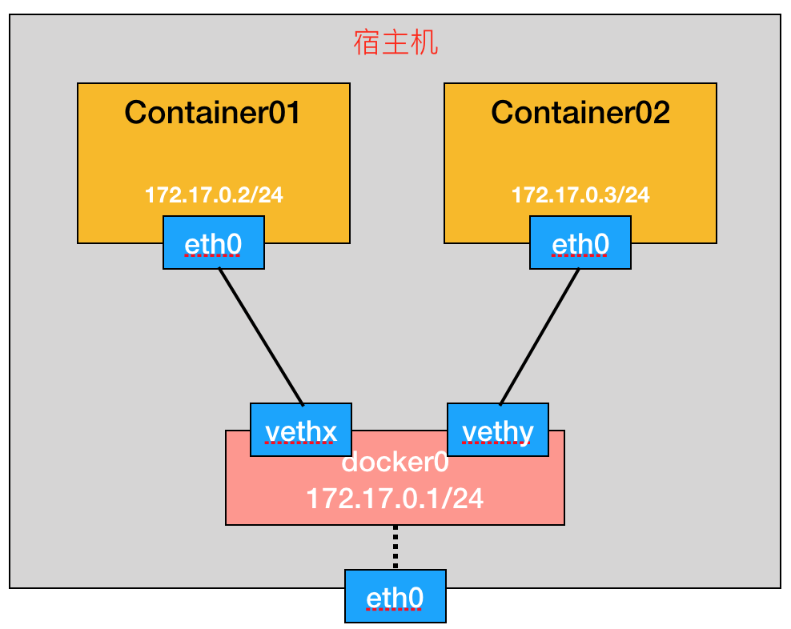

Dokcer 中容器的网络都是采用成熟的技术来实现的，例如 network namespace、iptables、Linux bridge、Linux veth 等等，要理解起来其实难度不大。这篇文章看看 Docker 网络中网络命名空间在其中的应用，网络命名空间是 Linux kernel 提供的一种轻量级网络隔离方案，隔离了包括网络设备、IPv4和IPv6协议栈、IP路由表、防火墙、/proc/net目录、/sys/class/net目录、端口（socket）等等。

## Docker 中的 bridge 网络

Docker 安装启动之后，会在宿主机上创建一个 docker0 这样的网络设备，并且分配了一个 IP 地址。这里的 docker0 有多重身份，它是一个 Linux 的虚拟网桥，类似于一个物理交换机的功能，可以创建端口，报文在其中能二层转发；同时它也是一个 Linux 的网络设备，在内核中与普通的网卡无异，报文可以被网络协议栈处理。你可以参考[这篇文章](http://tonybai.com/2016/01/15/understanding-container-networking-on-single-host/)来获取更多内容。

如下是用 `ip` 命令查看到 docker0 的信息：

``` bash
[root@localhost ~]# ip add sh docker0
6: docker0: <NO-CARRIER,BROADCAST,MULTICAST,UP> mtu 1500 qdisc noqueue state DOWN
    link/ether 02:42:3c:e6:72:b4 brd ff:ff:ff:ff:ff:ff
    inet 172.17.0.1/16 scope global docker0
       valid_lft forever preferred_lft forever

[root@localhost ~]# ip -d link sh docker0
6: docker0: <NO-CARRIER,BROADCAST,MULTICAST,UP> mtu 1500 qdisc noqueue state DOWN mode DEFAULT
    link/ether 02:42:3c:e6:72:b4 brd ff:ff:ff:ff:ff:ff promiscuity 0
    bridge
```

如果你安装了 `bridge-utils`  这样的工具包，那样你可以使用命令 `brctl` 查看到 Linux 的网桥：

``` bash
[root@localhost ~]# brctl show
bridge name	bridge id		STP enabled	interfaces
docker0		8000.02423ce672b4	no		
```

当使用命令创建一个容器之后，这里以 `ubuntu:14.04` 镜像为例，发现宿主机上多出一个网络设备 `veth71c3a08`，这是 Linux 中的 veth 设备。

``` bash
[root@localhost ~]# docker run -idt ubuntu:14.04
93e29ba347817635cb62aacdf295fd0aa8045884459c1f6deffd025b3dd94425
[root@localhost ~]# ip -d link sh
1: lo: <LOOPBACK,UP,LOWER_UP> mtu 65536 qdisc noqueue state UNKNOWN mode DEFAULT
    link/loopback 00:00:00:00:00:00 brd 00:00:00:00:00:00 promiscuity 0
...
6: docker0: <BROADCAST,MULTICAST,UP,LOWER_UP> mtu 1500 qdisc noqueue state UP mode DEFAULT
    link/ether 02:42:3c:e6:72:b4 brd ff:ff:ff:ff:ff:ff promiscuity 0
    bridge
22: veth71c3a08: <BROADCAST,MULTICAST,UP,LOWER_UP> mtu 1500 qdisc noqueue master docker0 state UP mode DEFAULT
    link/ether c6:62:45:4a:20:28 brd ff:ff:ff:ff:ff:ff promiscuity 1
    veth
```

veth 设备是 Linux 中一种虚拟网络设备，它总是成对出现，从一个设备发送的数据总是在另一个设备接收到，类似于一根网线的两端，用 veth 这个原理就很容易实现网络不同命名空间之间的通信问题。例如上例中 Docker 容器实现就是在宿主机的 root 命名空间创建一个 `veth71c3a08`，再创建了一个 veth peer 到该容器的网络命名空间中，也就是容器中的 `eth0`。进入到容器中查看网络信息：

``` bash
[root@localhost ~]# docker attach 93e29ba34781
root@93e29ba34781:/# ip add
1: lo: <LOOPBACK,UP,LOWER_UP> mtu 65536 qdisc noqueue state UNKNOWN group default
    link/loopback 00:00:00:00:00:00 brd 00:00:00:00:00:00
    inet 127.0.0.1/8 scope host lo
       valid_lft forever preferred_lft forever
...
21: eth0: <BROADCAST,MULTICAST,UP,LOWER_UP> mtu 1500 qdisc noqueue state UP group default
    link/ether 02:42:ac:11:00:02 brd ff:ff:ff:ff:ff:ff
    inet 172.17.0.2/16 scope global eth0
       valid_lft forever preferred_lft forever

root@93e29ba34781:/# ip -d link sh eth0
21: eth0: <BROADCAST,MULTICAST,UP,LOWER_UP> mtu 1500 qdisc noqueue state UP mode DEFAULT group default
    link/ether 02:42:ac:11:00:02 brd ff:ff:ff:ff:ff:ff promiscuity 0
    veth
```

回到宿主机，使用 `brctl` 命令查看网桥信息，发现在网桥上多了一个接口，正是创建容器中网卡的另一个 veth peer。这样容器中访问外部网络，从 `eth0` 发出来的报文就等于送到 `veth71c3a08`，再在 docker0 这个网桥上进行转发出去。

``` bash
[root@localhost ~]# brctl show
bridge name	bridge id		STP enabled	interfaces
docker0		8000.02423ce672b4	no		veth71c3a08
```

总结一下，Docker 中 bridge 网络其实非常简单，如下图所示，每个容器的网络在一个独立的网络命名空间内，他们之间是隔离的，通过 veth peer 对将其与 root 命名空间（也即宿主机所在的网络命名空间）相连。



## 怎么查看容器的网络命名空间

命令 `ip netns` 可以用来查看网络的命名空间，但是在宿主机上执行时却发现并没有，这是为什么呢？其实 `ip netns` 只能查看到使用该命令创建的命名空间，但 Docker 创建网络命名空间使用的是 Raw Socket 的接口来调用的。但我们还是有办法来使用 `ip netns` 来查看到 Docker 创建的命名空间的：获取到容器运行的进程 PID，取得其网络命名空间的虚拟文件，在 `/var/run/netns/` 目录下创建一个软链接即可。命令如下：

``` bash
[root@localhost ~]# docker ps
CONTAINER ID        IMAGE               COMMAND             CREATED             STATUS              PORTS               NAMES
93e29ba34781        ubuntu:14.04        "/bin/bash"         32 minutes ago      Up 32 minutes                           sad_northcutt
[root@localhost ~]# container_id=
[root@localhost ~]# pid=$(docker inspect -f '{{.State.Pid}}' ${container_id})
[root@localhost ~]# mkdir -p /var/run/netns/
[root@localhost ~]# ln -sfT /proc/$pid/ns/net /var/run/netns/$container_id
[root@localhost ~]# ip netns
93e29ba34781
```

接下来就可以使用 `ip` 命令来查看容器里的网络信息了，得到的结果和进到容器里查看的结果是一样的，这也证明了容器里的网络就是用网络命名空间来实现的。

``` bash
[root@localhost ~]# ip netns exec 93e29ba34781 ip -d link sh
1: lo: <LOOPBACK,UP,LOWER_UP> mtu 65536 qdisc noqueue state UNKNOWN group default
    link/loopback 00:00:00:00:00:00 brd 00:00:00:00:00:00
    inet 127.0.0.1/8 scope host lo
       valid_lft forever preferred_lft forever
...
21: eth0: <BROADCAST,MULTICAST,UP,LOWER_UP> mtu 1500 qdisc noqueue state UP group default
    link/ether 02:42:ac:11:00:02 brd ff:ff:ff:ff:ff:ff
    inet 172.17.0.2/16 scope global eth0
       valid_lft forever preferred_lft forever
```

还有一种方法不需要创建软连接，使用 `nsenter` 命令，有兴趣可以参考[SO上这个答案](https://stackoverflow.com/questions/31265993/docker-networking-namespace-not-visible-in-ip-netns-list)。

## 为容器再创建一个网卡

下面用前面讲到的知识，不通过调用 docker 的命令为容器再添加一张网卡。

1. 创建一个 Linux Bridge，取名为 docker1，并为 docker1 分配一个 IP：

    ``` bash
    [root@localhost ~]# brctl addbr docker1
    [root@localhost ~]# brctl show
    bridge name	bridge id		STP enabled	interfaces
    docker0		8000.02423ce672b4	no		vethfff8bb8
    docker1		8000.000000000000	no

    [root@localhost ~]# ip add add 172.18.0.1/16 dev docker1
    [root@localhost ~]# ip add show
    ...
    6: docker0: <BROADCAST,MULTICAST,UP,LOWER_UP> mtu 1500 qdisc noqueue state UP
    link/ether 02:42:3c:e6:72:b4 brd ff:ff:ff:ff:ff:ff
    inet 172.17.0.1/16 scope global docker0
       valid_lft forever preferred_lft forever
    27: docker1: <BROADCAST,MULTICAST,UP,LOWER_UP> mtu 1500 qdisc noqueue state UNKNOWN
    link/ether 42:d1:17:2a:99:d5 brd ff:ff:ff:ff:ff:ff
    inet 172.18.0.1/16 scope global docker1
       valid_lft forever preferred_lft forever
    ```

2. 创建一对 veth 设备，分别取名为 `veth-test` 和 `veth-test-peer`：

    ``` bash
    [root@localhost ~]# ip link add veth-test type veth peer name veth-test-peer
    [root@localhost ~]# ip link set veth-test up
    [root@localhost ~]# ip link show
    ...
    36: veth-test-peer: <BROADCAST,MULTICAST,UP,LOWER_UP> mtu 1500 qdisc pfifo_fast state UP mode DEFAULT qlen 1000
        link/ether 46:14:50:f9:18:49 brd ff:ff:ff:ff:ff:ff
    37: veth-test: <BROADCAST,MULTICAST,UP,LOWER_UP> mtu 1500 qdisc pfifo_fast state UP mode DEFAULT qlen 1000
        link/ether 0e:36:00:d9:58:fd brd ff:ff:ff:ff:ff:ff
    ```

3. 将其中的 `veth-test` 加到第一步创建的 Linux bridge 上，另一个 `veth-test-peer` 加入到容器的命名空间中，并重命名为 eth1、设置 IP 地址：

    ``` bash
    [root@localhost ~]# brctl addif docker1 veth-test
    [root@localhost ~]# brctl show
    bridge name	bridge id		STP enabled	interfaces
    docker0		8000.02423ce672b4	no		vethfff8bb8
    docker1		8000.baefdf2c27c9	no		veth-test

    [root@localhost ~]# ip link set veth-test-peer netns f376fa75f9f7
    [root@localhost ~]# ip netns exec ab3243b54282 ip link set veth-test-peer name eth1
    [root@localhost ~]# ip netns exec ab3243b54282 ip add add 172.18.0.2/16 dev eth1
    [root@localhost ~]# ip netns exec ab3243b54282 ip link set eth1 up
    [root@localhost ~]# ip netns exec ab3243b54282 ip add
    1: lo: <LOOPBACK,UP,LOWER_UP> mtu 65536 qdisc noqueue state UNKNOWN
        link/loopback 00:00:00:00:00:00 brd 00:00:00:00:00:00
        inet 127.0.0.1/8 scope host lo
           valid_lft forever preferred_lft forever
    ...
    30: eth0: <BROADCAST,MULTICAST,UP,LOWER_UP> mtu 1500 qdisc noqueue state UP
        link/ether 02:42:ac:11:00:02 brd ff:ff:ff:ff:ff:ff
        inet 172.17.0.2/16 scope global eth0
           valid_lft forever preferred_lft forever
    36: eth1: <BROADCAST,MULTICAST,UP,LOWER_UP> mtu 1500 qdisc pfifo_fast state UP qlen 1000
        link/ether 46:14:50:f9:18:49 brd ff:ff:ff:ff:ff:ff
        inet 172.18.0.2/16 scope global eth1
            valid_lft forever preferred_lft forever
    ```

4. 至此我们没用 docker 原生的网络命令就为容器添加了一张网卡，接下来进入容器中测试下创建的这张网卡网络连接是否正常。测试方法是通过新加得网卡 ping 宿主机的 IP 地址，由于默认路由被添加为走 eth0，现在手动添加一条路由：

    ``` bash
    [root@localhost ~]# ip netns exec ab3243b54282 ip route add 192.168.11.0/24 via 172.18.0.1
    [root@localhost ~]# ip netns exec ab3243b54282 ip route
    default via 172.17.0.1 dev eth0
    172.17.0.0/16 dev eth0 proto kernel scope link src 172.17.0.2
    172.18.0.0/16 dev eth1 proto kernel scope link src 172.18.0.2
    192.168.11.0/24 via 172.18.0.1 dev eth1

    [root@localhost ~]# docker attach ab3243b54282
    root@ab3243b54282:/#
    root@ab3243b54282:/# ping 192.168.11.120
    PING 192.168.11.120 (192.168.11.120) 56(84) bytes of data.
    64 bytes from 192.168.11.120: icmp_seq=1 ttl=64 time=0.062 ms
    64 bytes from 192.168.11.120: icmp_seq=2 ttl=64 time=0.068 ms
    ^C
    --- 192.168.11.120 ping statistics ---
    2 packets transmitted, 2 received, 0% packet loss, time 999ms
    rtt min/avg/max/mdev = 0.062/0.065/0.068/0.003 ms
    ```

## 参考资料

* http://www.infoq.com/cn/articles/docker-kernel-knowledge-namespace-resource-isolation
* http://cizixs.com/2017/02/10/network-virtualization-network-namespace
* https://coolshell.cn/articles/17029.html
* https://stackoverflow.com/questions/31265993/docker-networking-namespace-not-visible-in-ip-netns-list
* https://www.ibm.com/developerworks/cn/linux/1310_xiawc_networkdevice/index.html
