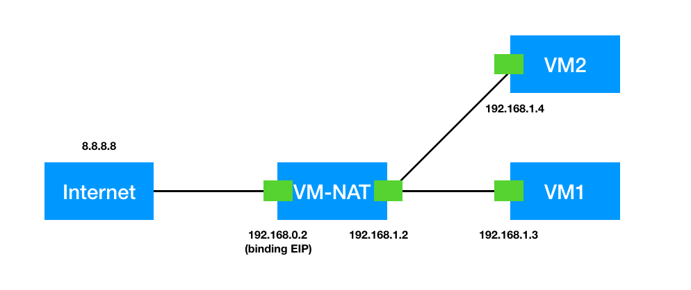
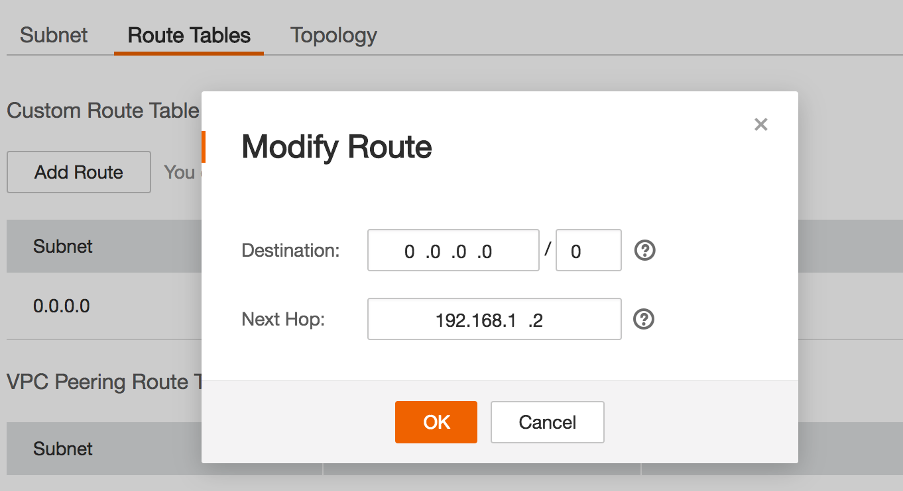
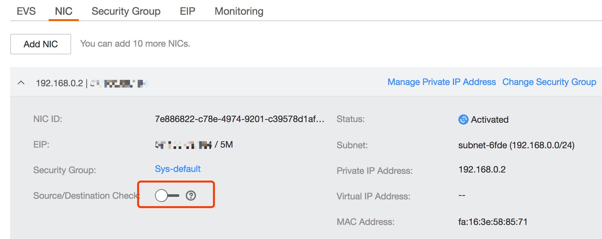

Linux系统网络中有两个比较常用的配置: ip_forward 以及 rp_filter，我已经遇到 many many times 了，这里通过一个案例来了解这两个配置。

在华为云上创建了两台虚拟机，一台绑定了公网IP、另一台没有公网IP，那怎么让没有公网IP的虚拟机能访问公网呢？方案有很多种，例如云计算中有个NAT网关的服务就可以做到，这里不使用该服务，只使用最基础的VPC服务也是可以做到的，下面是组网拓扑图：



一个VPC下有两个子网，网段分别为 subnet1: 192.168.0.0/24，subnet2: 192.168.1.0/24，虚拟机VM-NAT有两张网卡，其中一张网卡绑定了EIP可以出公网；VM1、VM2为没有申请EIP的虚拟机。要想VM1、VM2也能访问公网，可以让流量走到VM-NAT上，再由VM-NAT转发到公网。

1）首先，怎么使VM1访问公网流量导到VM-NAT上？华为云VPC服务提供了明细路由的功能，可以添加路由让流量导到某个服务器上；



2）添加完自定义路由之后，让下一跳走到VM-NAT虚拟机的192.168.1.2该网卡。通过抓包工具抓包确实发现该网卡收到来自VM1访问公网的报文；

3）VM-NAT虚拟机判断目的地址不为自己，默认会丢弃，而不是进行转发，如果需要使能转发，将Linux系统当成一个交换机/路由器的功能的话，那就需要使能**ip_forwad**开关了，下面的方法均可以（前两种没有持久化配置，服务重启或节点重启配置会恢复）：

* 执行 `echo 1> /proc/sys/net/ipv4/ip_forward`
* 执行 `sysctl -w net.ipv4.ip_forward=1`
* 编辑文件 `/etc/sysctl.conf`，将 `net.ipv4.ip_forward` 的值设为1，再执行 `sysctl -p` 使之生效。

4）设置完之后使用抓包工具抓包发现有报文送出去了，但是没有回报文，分析发现我们的源地址还是VM1的私网IP，VPC安全组有个特性开关，对虚拟机的源IP、MAC进行一致性校验（安全加固，可以防止伪造报文），那在ECS页面关闭该配置：



5) 此时抓包发现有环路，分析在于VPC上设置了默认路由，当报文出去之后，会再次送回主机；主要原因在于没有匹配到EIP的流量（源IP是没有绑定EIP的VM），解决方法是在VM-NAT上做一下SNAT，将源地址换成VM-NAT的绑定EIP的私网地址：`iptables -t nat -A POSTROUTING -o eth0 -j SNAT --to-source 192.168.0.2`

6) OK，终于通了。

-----

上面VM1将流量导到VM-NAT上是通过一个VPC的二层网络，但如果我要在VM1上ping VM-NAT的 192.168.0.2，发现 ping 不通，这是为什么呢？

照理说，可以通过VPC三层是可以通信的。这地方是经常会遇到的，多张网卡时出现的Linux系统中反向路由检查的校验将报文丢弃。反向路由校验也是Linux下的一个安全加固配置，大致意思是：当某个网卡收到一个报文时，进行反向路由检查（即将源地址和目的地址互换，检查路由表），如果路由匹配的回城流量和入方向不是同一个网卡，即认为反向路由检查不过，如果此时该网卡开启了 rp_filter 开关，则报文被丢弃。

例如该例中，VM-NAT的路由表如下：

``` bash
# ip route
169.254.169.254 via 192.168.0.1 dev eth0  proto static
192.168.1.0/24 dev eth1  proto kernel  scope link  src 192.168.1.2
192.168.0.0/24 dev eth0  proto kernel  scope link  src 192.168.0.2  metric 1
default via 192.168.0.1 dev eth0  proto static
```

从VM1(192.168.1.3)到VM-NAT(192.168.0.2)，回去的流量将会从VM-NAT的192.168.1.2的网卡送回去，不满足反向路由检查的条件。

关闭该特性也比较简单，前两种不会持久化配置：

* 执行 `echo 0 > /proc/sys/net/ipv4/conf/eth0/rp_filter`
* 执行 `sysctl -w net.ipv4.conf.eth0.rp_filter=0`
* 编辑文件 `/etc/sysctl.conf`，增加或修改 `net.ipv4.conf.eth0.rp_filter` 的值设为0，再执行 `sysctl -p` 使之生效。
