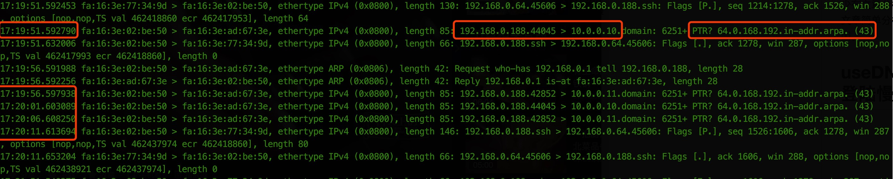
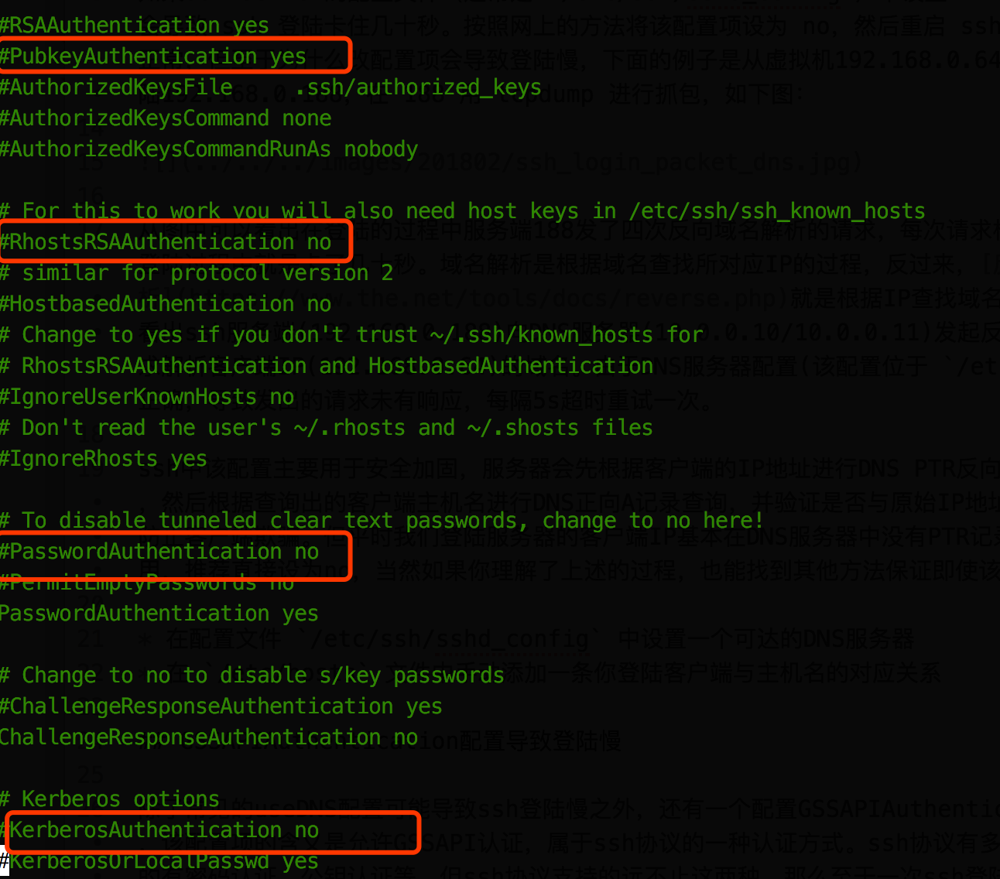
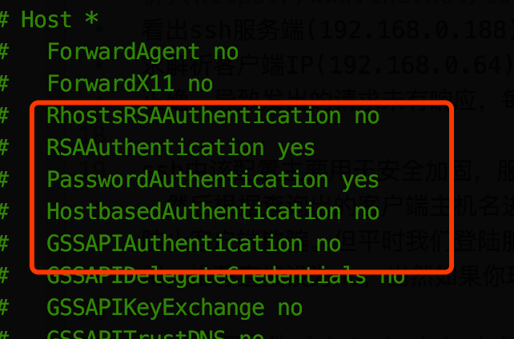
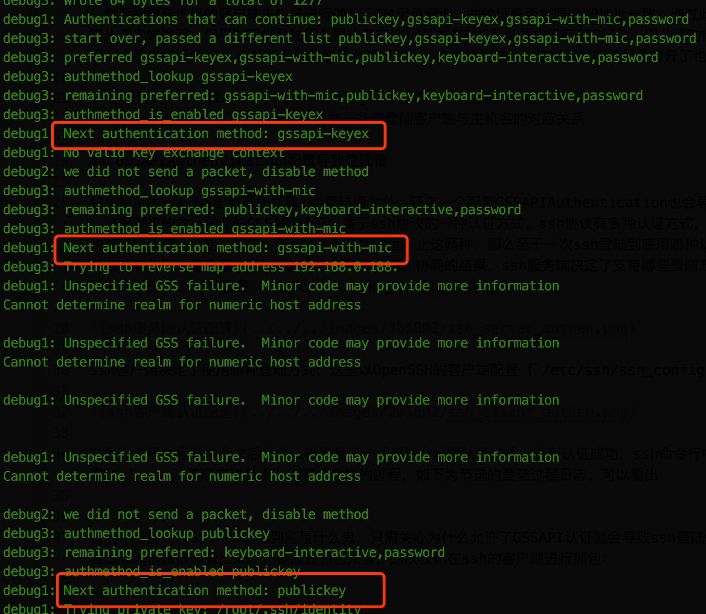
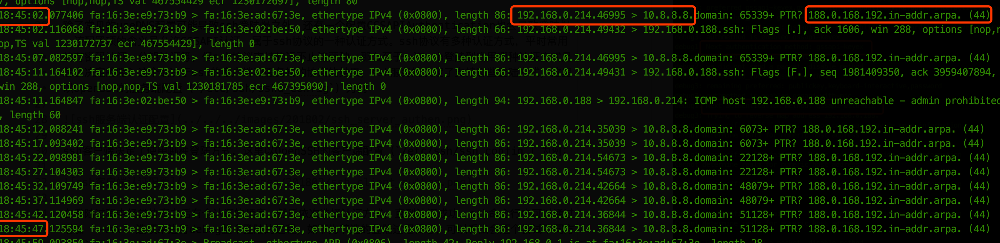

如果做运维就一定会遇到ssh登陆Linux服务器慢的问题，问题比较好解决，一般Google之后有很多文章都告诉你解决方法，但是很少有文章分析为什么会慢，这篇文章简单分析下ssh登陆慢的原因。

## useDNS配置导致登陆慢

如果ssh server的配置文件（通常是 `/etc/ssh/sshd_config`）中设置 **`useDNS yes`**，可能会导致 ssh 登陆卡住几十秒。按照网上的方法将该配置项设为 no，然后重启 ssh 服务，再次登陆就恢复正常，但至于为什么改配置项会导致登陆慢，下面的例子是从虚拟机192.168.0.64 ssh登陆192.168.0.188，在 188 用 tcpdump 进行抓包，如下图：

从图中可以看出在登陆的过程中服务端188发了四次反向域名解析的请求，每次请求相隔5s，共20s，反映在登陆过程中就是卡了几十秒。域名解析是根据域名查找所对应IP的过程，反过来，[反向域名解析](https://www.the.net/tools/docs/reverse.php)就是根据IP查找域名的过程，从抓包的图中看出ssh服务端(192.168.0.188)向DNS服务器(10.0.0.10/10.0.0.11)发起反向域名解析的请求，请求解析客户端IP(192.168.0.64)的域名。由于DNS服务器配置(该配置位于 `/etc/resolv.conf`)的不正确，导致发出的请求未有响应，每隔5s超时重试一次。

ssh中该配置主要用于安全加固，服务器会先根据客户端的IP地址进行DNS PTR反向查询出客户端的主机名，然后根据查询出的客户端主机名进行DNS正向A记录查询，并验证是否与原始IP地址一致，通过此种措施来防止客户端欺骗。但平时我们登陆服务器的客户端IP基本在DNS服务器中没有PTR记录，因此该功能显得很无用，推荐直接设为no，当然如果你理解了上述的过程，也能找到其他方法保证即使该配置打开了也不慢：

* 在配置文件 `/etc/ssh/sshd_config` 中设置一个可达的DNS服务器
* 在 `/etc/hosts` 文件中手动添加一条你登陆客户端与主机名的对应关系

## GSSAPIAuthentication配置导致登陆慢

除了常见的useDNS配置可能导致ssh登陆慢之外，还有一个配置GSSAPIAuthentication也会导致登陆慢，该配置项的含义是允许GSSAPI认证，属于ssh协议的一种认证方式。ssh协议有多种认证方式，平时常用的有密码认证、公钥认证等，但ssh协议支持的远不止这两种，那么至于一次ssh登陆到底用哪种认证方式是怎么决定的呢？这个取决于ssh的客户端和服务端的协商的结果，ssh服务端决定了支持哪些登陆方式，这里以OpenSSH的服务端配置（`/etc/ssh/sshd_config`）为例：

ssh客户端决定了使用哪种登陆方式，这里以OpenSSH的客户端配置（`/etc/ssh/ssh_config`）为例：

在登陆过程中经常协商之后有个认证的顺序，然后依次选择认证方式，直到认证成功，ssh命令行中可以通过增加 `-vvv` 选项来进行debug整个登陆的过程，如下为节选的登陆过程日志，可以看出会逐个尝试不同方式去认证：

我们不需要关心GSSAPI认证到底是什么鬼，只需关心为什么允许了GSSAPI认证就会导致ssh登陆慢呢？直接看debug信息很难看出来，还是通过抓包来看。下面例子是通过虚拟机192.168.0.214 ssh登陆192.168.0.188，这次我们在ssh的客户端进行抓包：

同样也发现有大量的DNS反向域名解析的报文，但这次需要解析的是服务端的IP（192.168.0.188），同样由于客户端侧配置的DNS服务器（10.8.8.8）不可达，导致超时重试多次。结合ssh登陆的过程日志，不难发现这写DNS反向域名解析的报文是GSSAPI认证需要的。

那么解决该问题就比较简单了，下面任何一种都可：

* ssh 客户端配置（`/etc/ssh/ssh_config`）将 `GSSAPIAuthentication` 设为 **no**
* ssh 服务端配置（`/etc/ssh/sshd_config`）将 `GSSAPIAuthentication` 设为 **no**
* ssh 客户端正确配置 DNS 服务器（`/etc/resolv.conf`）
* ssh 客户端 hosts 文件（`/etc/hosts`）增加服务端的IP、主机名对应关系

## 总结

本文分析了ssh的两个配置可能导致登陆慢的原因以及解决方法，主要想说的是通过抓包可以很容易分析登陆慢的原因。
