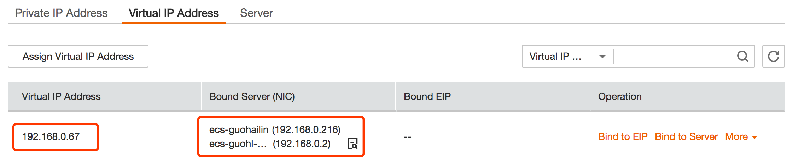
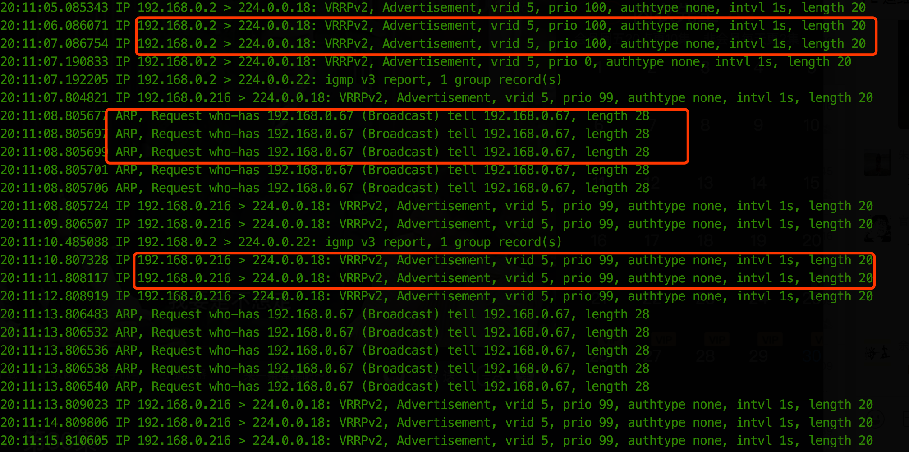
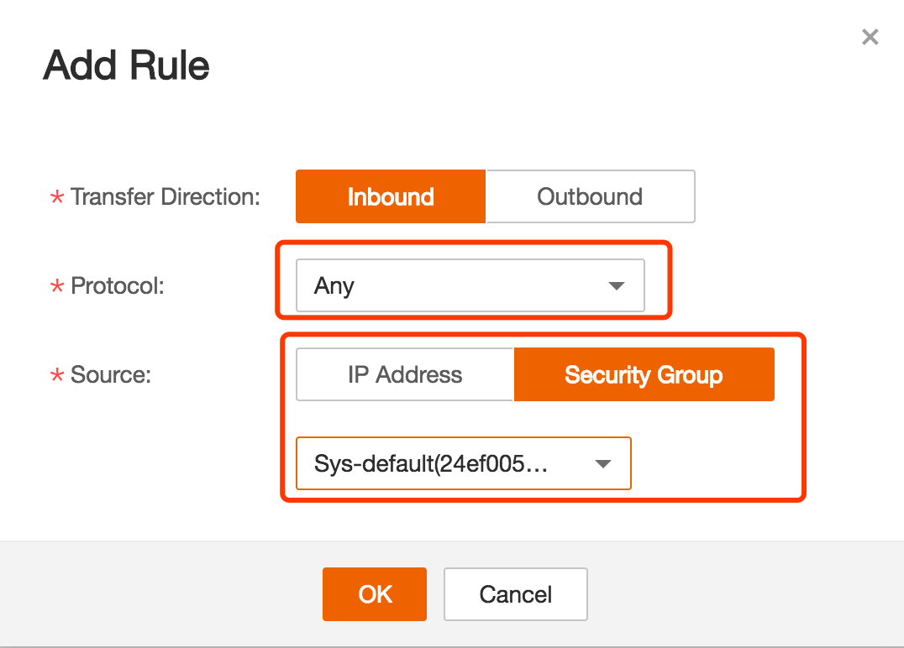

华为云VPC有个特性是虚IP（Virtual IP），虚IP的功能类似于浮动IP，可以绑定到多个ECS上，但是该特性很容易受到客户使用上的困惑，以为VIP绑定了到多个ECS上就能自动配置，其实不然，VIP的使用需要手动或借助其他软件来实现在ECS之间的切换。

下图为我在云上创建一个VIP（192.168.0.67），绑定到两台ECS上，ECS的VPC私有IP分别为192.168.0.2、192.168.0.216，这里演示下如何使用keepalived实现VIP在两台虚拟机之间的切换。



## 安装和配置keepalived

分别在两台ECS上安装keepalived，我的虚拟机是centos操作系统，可以直接使用`yum install -y keepalived`来安装，安装完成之后需要对两个ECS上的keepalived进行配置。

**ECS1（192.168.0.2）的配置**

``` bash
# cat /etc/keepalived//keepalived.conf
! Configuration File for keepalived

vrrp_instance VI_1 {
    state MASTER
    interface eth0
    virtual_router_id 5
    priority 100
    advert_int 1
    virtual_ipaddress {
        192.168.0.67
    }
}
```

**ECS2（192.168.0.216）的配置**

``` bash
# cat /etc/keepalived//keepalived.conf
! Configuration File for keepalived

vrrp_instance VI_1 {
    state BACKUP
    interface eth0
    virtual_router_id 5
    priority 99
    advert_int 1
    virtual_ipaddress {
        192.168.0.67
    }
}
```

keepalived的配置文件中几个字段的含义：

* state：初始的状态，MASTER为主、BACKUP为备；
* interface：表示虚IP配置的网络设备
* virtual_router_id：虚拟路由的ID，相同的VRID为一组，不同的组需要设置不同的VRID
* priority：本节点选举算法中的优先级，优先级高的会最终被选为MASTER节点
* advert_int：发VRRP包的时间间隔，即多久进行一次master选举
* virtual_ipaddress：虚IP的地址

## 测试keepalived中VIP倒换

配置完keepalived的配置文件之后，分别在两台ECS上启动keepalived服务，可以使用命令 `service keepalived start`来启动，此时查看两台ECS的网络配置：

**ECS1的网络信息**

```
# ip add
...
2: eth0: <BROADCAST,MULTICAST,UP,LOWER_UP> mtu 1500 qdisc pfifo_fast state UP qlen 1000
    link/ether fa:16:3e:58:85:71 brd ff:ff:ff:ff:ff:ff
    inet 192.168.0.2/24 brd 192.168.0.255 scope global eth0
    inet 192.168.0.67/32 scope global eth0
    inet6 fe80::f816:3eff:fe58:8571/64 scope link
       valid_lft forever preferred_lft forever
```

**ECS2的网络信息**

```
# ip add
...
2: eth0: <BROADCAST,MULTICAST,UP,LOWER_UP> mtu 1500 qdisc pfifo_fast state UP qlen 1000
    link/ether fa:16:3e:35:fc:32 brd ff:ff:ff:ff:ff:ff
    inet 192.168.0.216/24 brd 192.168.0.255 scope global eth0
    inet6 fe80::f816:3eff:fe35:fc32/64 scope link
       valid_lft forever preferred_lft forever
```

可以看到VIP配置在ECS1的eth0上，因为ECS1的优先级较大，所以在VRRP协议选举中会被选为MASTER节点。如果此时将ECS1关机，会发现VIP会被自动配置在ECS2的eth0上。

而且此时查看ECS2上`/var/log/message`会有以下日志：

```
Mar  3 19:59:07 share-6-8 Keepalived_vrrp[13205]: VRRP_Instance(VI_1) Transition to MASTER STATE
Mar  3 19:59:08 share-6-8 Keepalived_vrrp[13205]: VRRP_Instance(VI_1) Entering MASTER STATE
Mar  3 19:59:08 share-6-8 Keepalived_vrrp[13205]: VRRP_Instance(VI_1) setting protocol VIPs.
Mar  3 19:59:08 share-6-8 Keepalived_vrrp[13205]: VRRP_Instance(VI_1) Sending gratuitous ARPs on eth0 for 192.168.0.67
Mar  3 19:59:08 share-6-8 Keepalived_healthcheckers[13204]: Netlink reflector reports IP 192.168.0.67 added
Mar  3 19:59:13 share-6-8 Keepalived_vrrp[13205]: VRRP_Instance(VI_1) Sending gratuitous ARPs on eth0 for 192.168.0.67
```

也能看出keepalived中VIP切换大概过程：进入MASTER状态之后，会在eth0上配置上VIP，然后发送免费ARP。使用抓包工具也能看出此过程：



## 两个ECS上同时配置了VIP原因分析

在我测试过程中发现keepalived启动之后，两台ECS上都配置了VIP，很明显这是不对的，出现该种问题主要有以下几种原因：

* **配置问题**，这里就不多说了，如果按照上面的配置基本没问题
* **安全组问题**，由于keepalived使用的是VRRP协议来实现的，该协议利用组播来定时发送消息通知各个节点状态，所以安全组最好增加下面的这条：



* **主机防火墙问题**，有些镜像中有默认的安全组，会reject掉组播的消息，导致ECS无法收到其他节点的VRRP组播消息，此时可以增加一条规则：`iptables -I INPUT -p vrrp -j ACCEPT`，例如下面我的防火墙规则增加之后变成下面这样就OK了：


