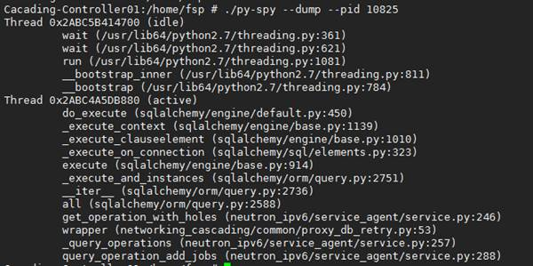

在测试环境上遇到一个问题，我们的组件处理数据非常慢，不知道在处理什么卡住或者线程抛异常退出了或者死循环了，从日志上也没能分析个所以然来，求助大神找到一个py-spy工具，可以分析该问题。

[Py-spy](https://github.com/benfred/py-spy)是一款 Python 应用采样分析器，允许在**不重启和修改源代码**的情况下，可视化正在运行的Python程序的调用栈、时间消耗等，这对于分析生产环境程序是非常关键的。而且安装使用都非常简单，安装可以用 `pip install py-spy` 直接安装，使用命令行格式为 `py-spy [FLAGS] [OPTIONS] --pid <pid>`，其中：

	• pid 为需要采样程序的PID号
	• FLAGS 比较常用的有 --dump，可以查看该进程的调用栈（包括各个线程）
	• OPTIONS可以配置的参数主要有：
		○ -d/--duration <duration>   采样的时间，默认为2秒
		○ -f/--flame <flamefile>   采样生成的火焰图名字
		○ -r/--rate <rate>   采样的频率，默认为200次每秒

这里就使用该工具来进行分析我的问题。
1. 执行命令 `py-spy -p 10825`，结果如下，会动态刷新，类似于top命令的结果。

	
结果上看出，do_execute函数执行时间占用了100%，程序卡在这个函数上，这个是selalchemy库中执行数据库语句的函数，可以从结果中其它函数推测该语句是从哪个业务函数调用的。当然还有更好的方式。
	
2. 执行命令 `py-spy --dump -p 10825`，结果如下可以看到列出了该进程的两个线程的调用栈，从这个结果就很容易知道第1步中do_execute函数最终的调用栈关系。

	
3. 当然还可以用更可视化全局分析哪个函数消耗时间较长，火焰图就是一个有利的工具，py-spy也支持生成火焰图文件，使用命令 `py-spy --flame profile.svg --duration 300 -p 10825` 采样300s生成火焰图文件。

将该文件拷贝到windows用浏览器打开，生成的火焰图如下：

	
[火焰图](http://www.brendangregg.com/flamegraphs.html)中颜色不说明什么，y轴表示函数的调用栈，x轴表示函数的执行时间，那么函数在x轴越宽表示执行时间越长，也说明是性能的瓶颈点。

4. 最终很容易找到是一条查询语句的耗时非常长，超过几分钟了，然后找数据库同事一起分析最终找到问题原因，进行了sql查询语句的优化，问题解决。

总之，这是一个非常实用小巧简单的python性能分析工具。

