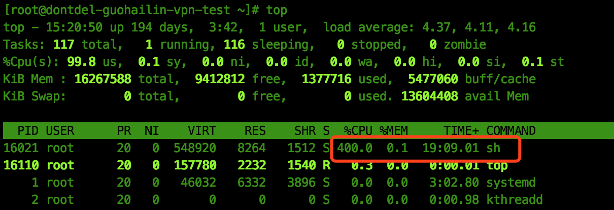
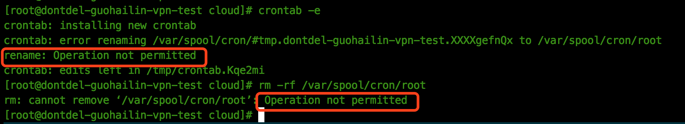

## 问题背景

我在某海外的公有云平台上买了一台虚拟机用来搭建梯子进行科学上网，这阵子发现上网速度极慢，打开个google有时都很吃力，今天登陆到后台检查一下，才发现我的这台服务器被黑了，下面是使用`top`命令查看到一个异常进程将所有的cpu都跑满了：



很显然我的服务器被注入了异常程序，我赶紧将这个进程给kill掉，但过一会该进程又被拉起来了，我立马想到这应该是在我的服务器中起了一个定时任务，于是我使用`crontab`命令查看(`crontab`命令的使用可以参考我之前的[一篇文章](http://hazirguo.github.io/articles/2018/crontab_command_tutorial.html))，果然有个每分钟运行的任务：


当我想用命令去删除这个定时任务时报错，用命令删除定时任务的文件也报错：



可是我当前是root用户，为什么还没有权限去修改或者删除一个文件呢？这时就要引入文件权限管理的知识了。

## chattr与lsattr

我们都知道Linux下可以使用命令`chmod`来修改一个文件的权限，例如可以设置不同用户对文件读、写、执行等权限，使用命令`lsmod`来查看文件的权限。但一个文件的权限还远远不止这三种，更底层的文件权限控制就可以使用`chattr`来进行控制，使用`lsattr`来进行查询。例如我们查看下上节删除失败的定时任务文件的属性：

``` bash
# lsattr /var/spool/cron/root
----ia---------- /var/spool/cron/root
```

这个文件的属性有**ia**的标志位，其中**i**表示该文件不能被删除、重命名、软链接，也不能增加、修改文件的内容，**a**表示只能向文件中增加（append）内容。由于设置了这些属性，导致删除文件失败，可以使用`chattr`来修改文件的属性，例如当我们减去这两个属性之后，文件成功地被删除。

``` bash
# chattr -ia /var/spool/cron/root
# lsattr /var/spool/cron/root
---------------- /var/spool/cron/root
# rm -rf /var/spool/cron/root
```

**`chattr`**命令的格式为 **+-=[aAcCdDeijsStTu]**，其中符号+、-、=分别表示对属性的追加、移除、更新指定的值，后面每个字母代表一种属性值，详细解释查看`man chattr`的结果；

## 写在最后

记下这个案例不仅仅为了学习两个命令的用法，后来我反思了一下为什么我的服务器会被黑，查看了`last`登陆记录以及`message`日志，应该是有一天我将ssh的登陆方式从以前的仅允许密钥登陆改成也可以使用密码登陆，并且账户的密码是一个弱密码，导致被暴力破解。

暴露在互联网上的机器无时无刻不在受到攻击，安全意识需要时刻牢记啊~
